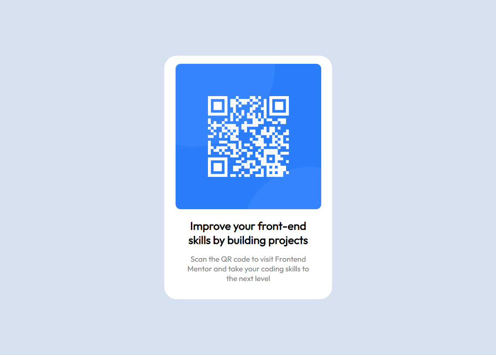

# Frontend Mentor - QR code component solution

This is a solution to the [QR code component challenge on Frontend Mentor](https://www.frontendmentor.io/challenges/qr-code-component-iux_sIO_H). Frontend Mentor challenges help you improve your coding skills by building realistic projects. 

## Table of contents

- [Overview](#overview)
  - [Preview](#preview)
  - [Links](#links)
- [My process](#my-process)
  - [Built with](#built-with)
  - [What I learned](#what-i-learned)
  - [Continued development](#continued-development)
  - [Useful resources](#useful-resources)
- [Author](#author)
- [Acknowledgments](#acknowledgments)

**Note: Delete this note and update the table of contents based on what sections you keep.**

## Overview

### Preview

### Links

- Live Site URL: [https://madeline0421.github.io/qr-code-component/](https://madeline0421.github.io/qr-code-component/)

## My process

### Built with

- Semantic HTML5 markup
- CSS custom properties
- Flexbox

### What I learned

I wanted this project to be a review for HTML/CSS, and I learned a lot of small but important details about CSS: 

- The difference between the "content-box" box model and the "border-box" box model: the "content-box" box model includes padding and borders into the calculation of the width of an element. 
    - Therefore, when I was trying to keep the width of the box the same while increasing padding, the approach is to decrease the width and increase the padding by the same amount I've decreased the width.
- Also, use `<h1> `to `<h6>` tags to define heading, from most important to least important headings, so they do not necessarily refer to the size and weight of the text. Only one `<h1>` should be used per page.
- Make sure alts for images are more specific to be actually useful.

### Useful resources

- ["Content-box" box model vs "border-box" box model](https://stackoverflow.com/questions/4698054/does-element-width-include-padding) - This helped clarify the difference between the two models.
- [https://www.frontendmentor.io/solutions/qr-code-using-csshtml-1_9hS1ktm7#comment-65a7f3e09b5bc8d819b20ff1](https://www.frontendmentor.io/solutions/qr-code-using-csshtml-1_9hS1ktm7#comment-65a7f3e09b5bc8d819b20ff1) - This was feedback I received from members of Frontend Mentor that helped me understand these details. Thank you!

## Author

- Website - [Madeline Hou](https://github.com/Madeline0421)
## Acknowledgments

Thank you to [@javascriptor1](https://github.com/javascriptor1) and [@danielmrz-dev](https://github.com/danielmrz-dev) for feedback!